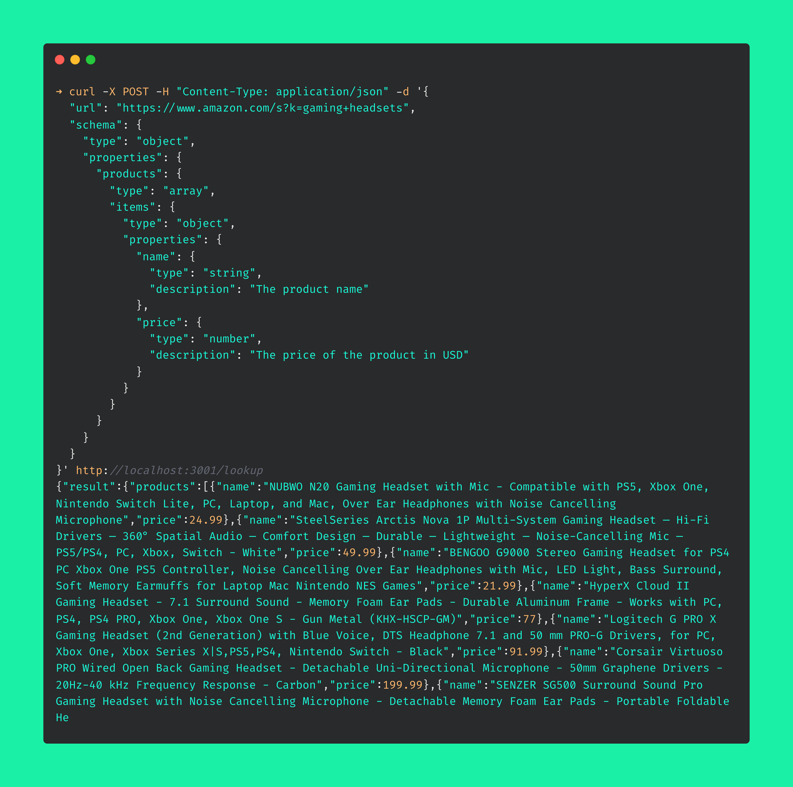

# JsonGenius

JsonGenius is a self-hosted scraping API that extracts structured data described by a [JSON Schema](https://json-schema.org). Provide any URL and a desired JSON Schema, and JsonGenius will return the structured data from the website.

## Demo


## Prerequisites
- [Docker Compose](https://docs.docker.com/compose/install/)
- `OPEN_AI_KEY` - An API key for [OpenAI](https://openai.com/). You can get one for free [here](https://platform.openai.com/account/api-keys). This should be set as an environment variable.

## Usage
####  Docker Compose (recommended)
```bash
git clone https://github.com/semanser/jsongenius
cd jsongenius
export OPEN_AI_KEY=<your key here>
docker compose up
```
The API will be available at http://localhost:3001. You can change the port by editing the `docker-compose.yml` file.

#### Compile from source
```bash
git clone https://github.com/semanser/jsongenius
cd jsongenius
export OPEN_AI_KEY=<your key here>
go build .
./jsongenius
```

## API

### POST /lookup
This endpoint accepts a JSON body with the following fields:
- `url`: The URL of the website to scrape
- `schema`: The JSON Schema to use to extract data from the website. The schema must be a valid JSON Schema object. Read more about JSON Schema [here](https://json-schema.org/).

#### Example
```bash
curl -X POST -H "Content-Type: application/json" -d '{
  "url": "https://www.amazon.com/s?k=gaming+headsets",
  "schema": {
    "type": "object",
    "properties": {
      "products": {
        "type": "array",
        "items": {
          "type": "object",
          "properties": {
            "name": {
              "type": "string",
              "description": "The product name"
            },
            "price": {
              "type": "number",
              "description": "The price of the product in USD"
            }
          }
        }
      }
    }
  }
}' http://localhost:3001/lookup
```

### FAQ
- **Does it work with JS heavy websites?** Yes! JsonGenius uses Chromium to render the page, so it can handle any website that a normal browser can.
- **Can I bring my own Chromium instance?** Yes! You can set the `WS_URL` environment variable that points to a [Chrome DevTools Protocol](https://chromedevtools.github.io/devtools-protocol/) endpoint. JsonGenius will use that instead of spinning up its own Chromium instance.
